### 📸 Passo a Passo em Imagens

#### 1. Configuração do Cluster
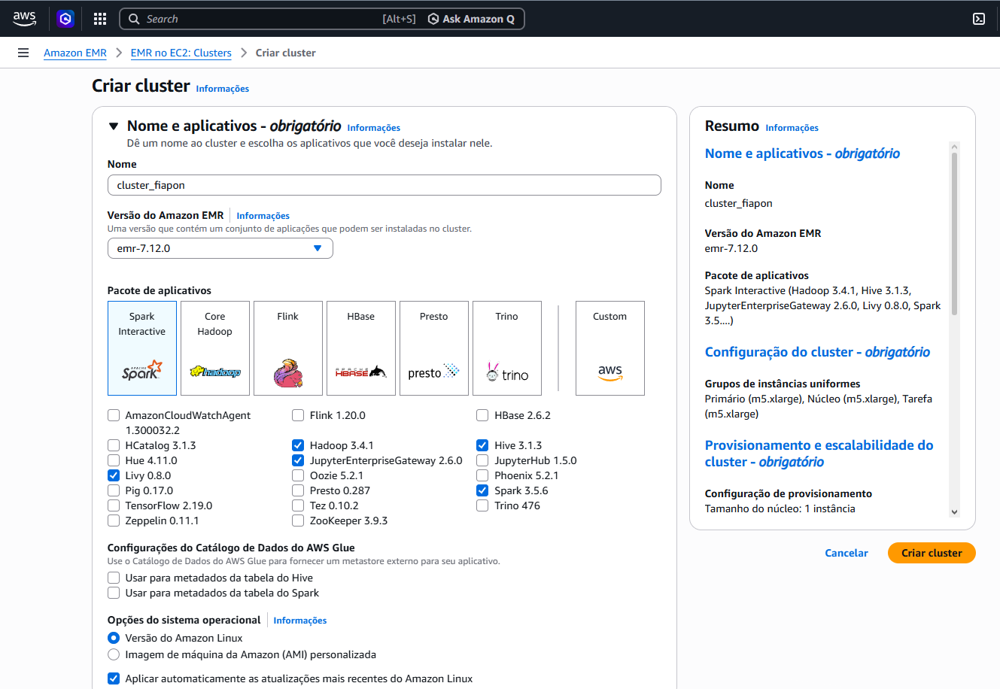

#### 2. Configuração do Cluster
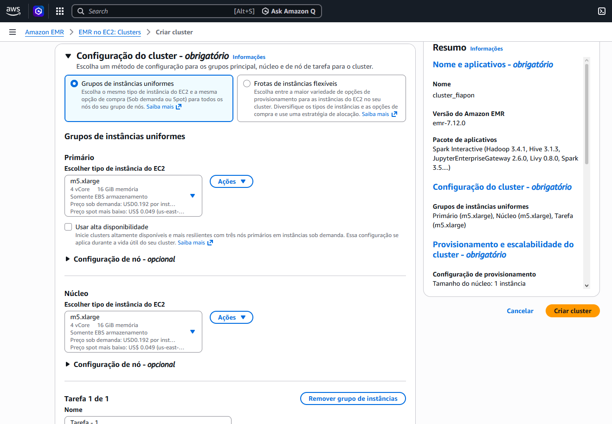

#### 3. Configuração do Cluster
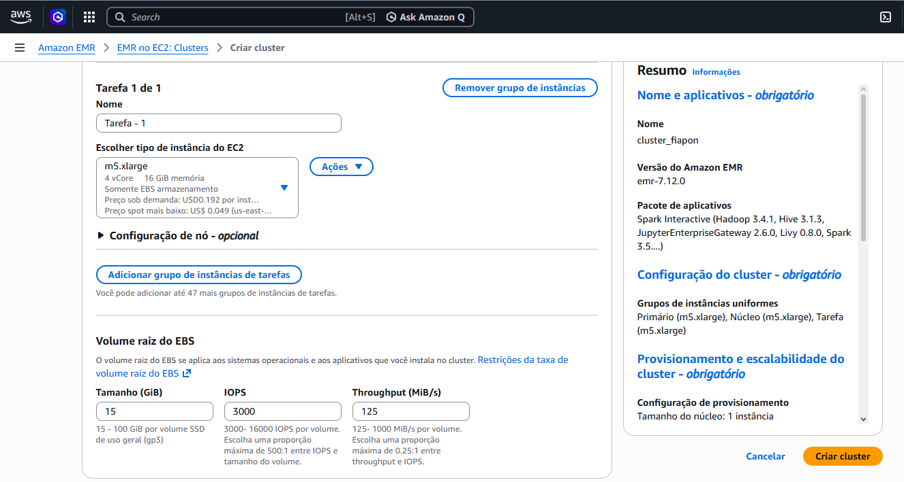

#### 4. Configuração do Cluster

#### 5. Configuração do Cluster

#### 6. Criacao VPC
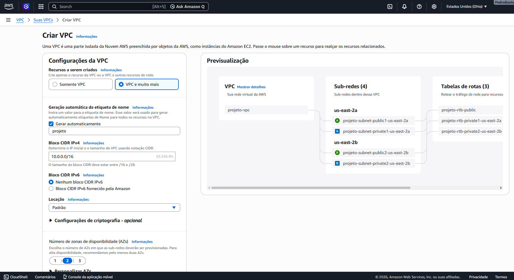

#### 7. Fluxo de VPC
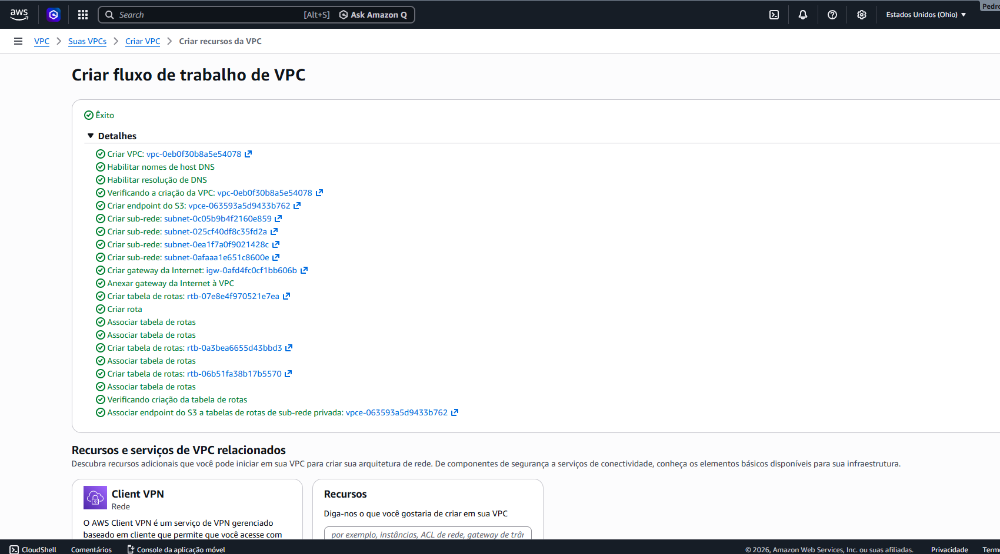

#### 8. CONFIG IAM
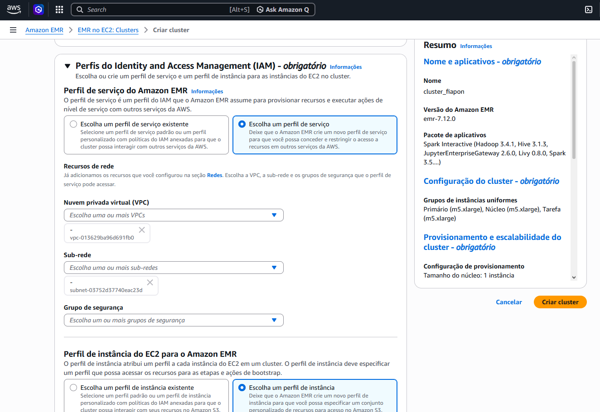

#### 9. instanciaEC2
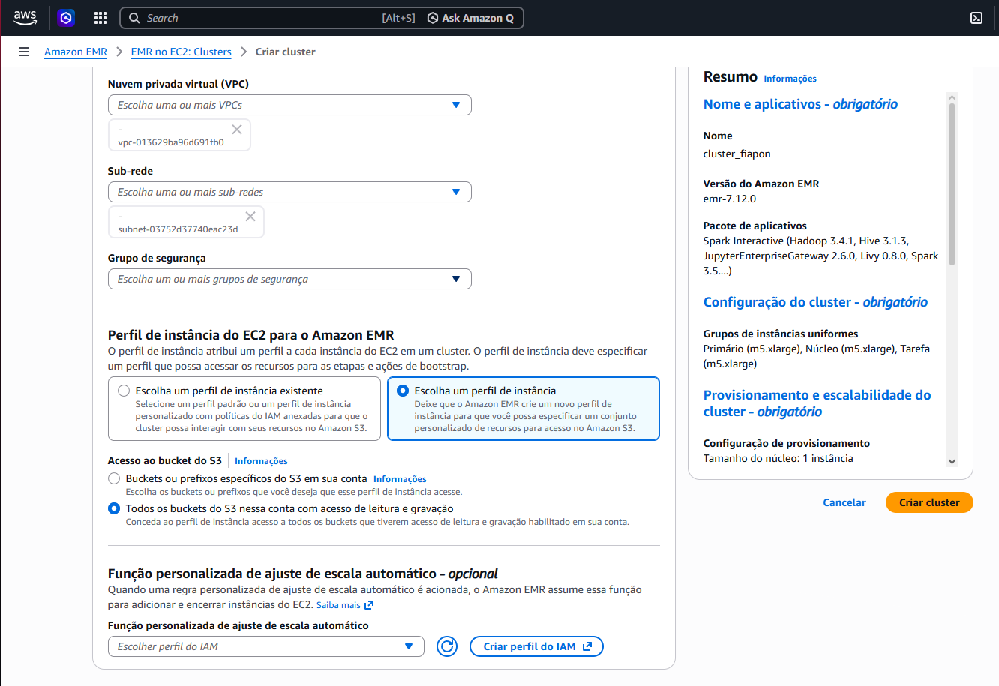

#### 10. Cluster Criado
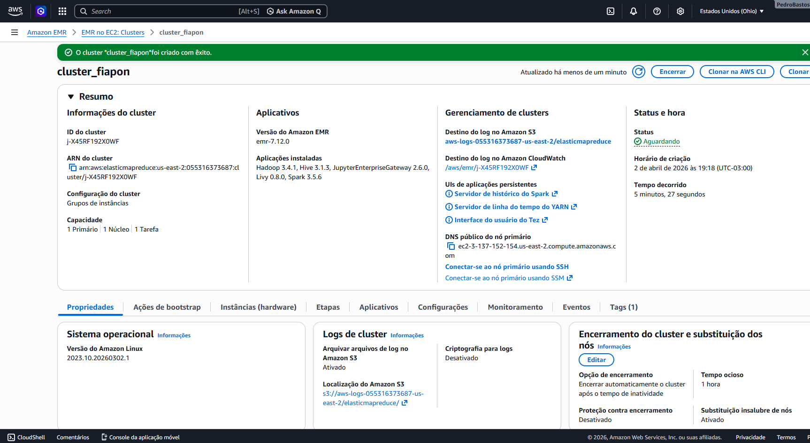

#### 11. Etapas
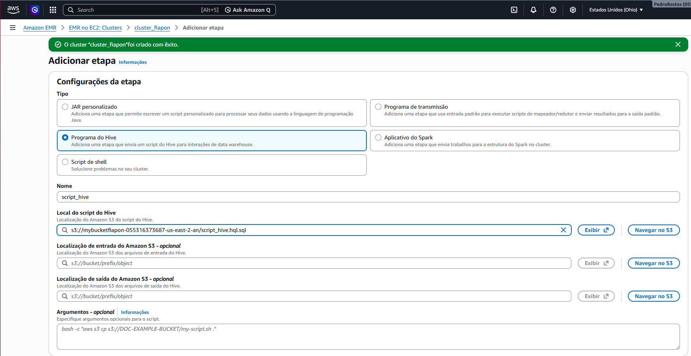

#### 12. Etapa com Obj completo
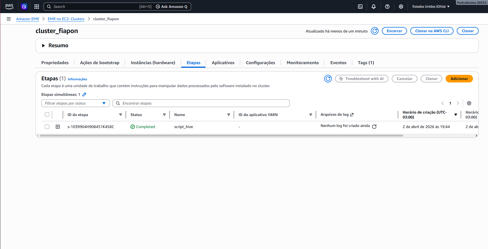

#### 13. Final
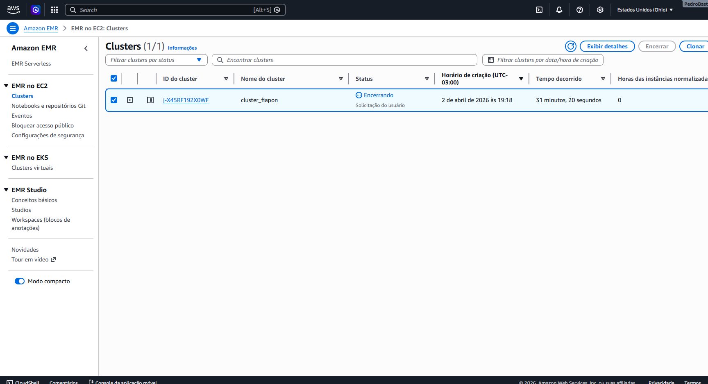
