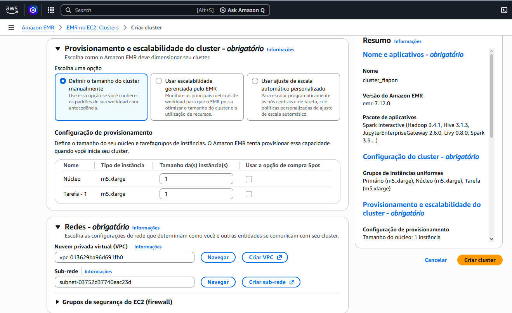
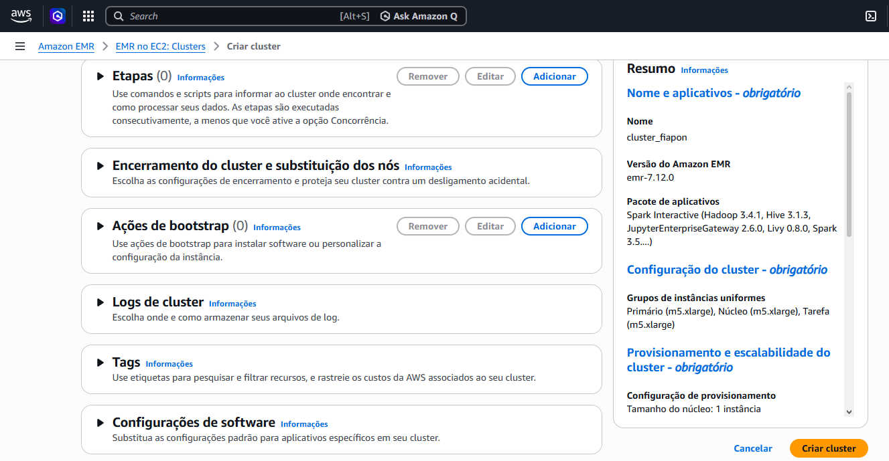

### 📸 Passo a Passo em Imagens

#### 1. Configuração do Cluster EMR e Stack de Software
Descrição Técnica: Definição do nome do cluster, escolha da versão do Amazon Linux e seleção do pacote de aplicativos (Hadoop, Hive e Spark).

#### 2. Configuração de Instâncias e Dimensionamento do Cluster
Descrição Técnica: Seleção do tipo de instância EC2 (m5.xlarge) para os nós Primário (Master) e de Núcleo (Core), definindo a capacidade de CPU e memória para o processamento distribuído.

#### 3. Configuração de Armazenamento EBS e Nós de Tarefa
Descrição Técnica: Definição do volume raiz do Amazon EBS (15 GiB gp3) e configuração do Nó de Tarefa (Task Node). Esta etapa é crucial para garantir que as instâncias tenham espaço em disco suficiente para o sistema operacional e para os logs das aplicações do ecossistema Hadoop.

#### 4. Provisionamento de Escalabilidade e Configuração de Rede (VPC)
Descrição Técnica: Definição do tamanho do cluster de forma manual, garantindo um nó de núcleo e um nó de tarefa fixos. Nesta etapa, também foi configurada a Nuvem Privada Virtual (VPC) e a Sub-rede, garantindo que o cluster EMR seja isolado e seguro dentro da infraestrutura da AWS.

#### 5. Configurações de Gerenciamento, Logs e Tags do Cluster
Descrição Técnica: Etapa final de configuração onde são definidos os parâmetros de Logs do Cluster (armazenados no S3 para auditoria), Ações de Bootstrap (para instalação de softwares customizados) e Tags. O uso de Tags é uma prática recomendada para organização de recursos e alocação de custos em ambientes corporativos.

#### 6. Arquitetura de Rede: Criação de VPC, Sub-redes e Tabelas de Rotas
Descrição Técnica: Provisionamento de uma VPC (Virtual Private Cloud) customizada utilizando o assistente "VPC e muito mais". A imagem detalha a criação automática de sub-redes públicas e privadas em múltiplas zonas de disponibilidade (us-east-2a e us-east-2b), além das tabelas de rotas necessárias para o isolamento e comunicação do ambiente de Big Data.

#### 7. Validação e Fluxo de Trabalho da Infraestrutura de Rede
Descrição Técnica: Verificação de êxito na criação de todos os componentes da rede, incluindo a habilitação de DNS, criação de sub-redes, gateways de internet e o S3 Endpoint. O Endpoint do S3 é um detalhe técnico avançado que permite que o cluster EMR se comunique com o S3 de forma privada, aumentando a performance e a segurança do pipeline de dados.

#### 8. Configuração de Perfis IAM e Permissões de Serviço
Descrição Técnica: Definição dos perfis do AWS IAM (Identity and Access Management). Nesta etapa, foi configurado o perfil de serviço do Amazon EMR e o perfil de instância do EC2. Essas roles permitem que o cluster tenha as permissões necessárias para acessar outros recursos da AWS, como o S3 e o CloudWatch, seguindo o princípio do privilégio mínimo.

#### 9. Configuração de Acesso ao Data Lake (S3) e Perfil de Instância
Descrição Técnica: Definição do acesso às instâncias EC2 do cluster. Foi configurado o acesso total de leitura e gravação a todos os buckets do Amazon S3 na conta, garantindo que o pipeline possa ler os datasets e persistir os resultados do processamento Hive sem barreiras de permissão entre os nós.

#### 10. Cluster Provisionado e Pronto para Uso (Status: Aguardando)
Descrição Técnica: Confirmação de que o cluster cluster_fiapon foi criado com êxito. A imagem exibe o resumo completo do ambiente: ID do cluster, DNS público do nó primário para conexões SSH/SSM e o status "Aguardando", indicando que a infraestrutura está operacional e pronta para receber o primeiro Step de processamento.

#### 11. Configuração e Submissão de Job Hive (Steps)
Descrição Técnica: Adição de uma etapa (Step) de processamento utilizando o Apache Hive. Nesta tela, é feita a referência ao arquivo script_hive.hql.sql armazenado no Amazon S3. Essa abordagem demonstra o conhecimento em desacoplamento de storage e compute, onde o cluster processa instruções SQL sobre dados persistidos de forma externa.

#### 12. Validação Final e Sucesso do Job Hive
Descrição Técnica: Painel de monitoramento de etapas exibindo o status final "Completed" para o job script_hive. Esta evidência confirma que o cluster processou corretamente as instruções SQL e que a integração entre o Amazon EMR e os scripts armazenados no S3 funcionou sem erros.

#### 13. Encerramento de Recursos e Governança de Custos

Descrição Técnica: Confirmação do status "Encerrando" (Solicitação do usuário) do cluster após exatos 31 minutos de operação. Esta evidência demonstra a aplicação de boas práticas de FinOps, garantindo que a infraestrutura de Big Data seja utilizada apenas pelo tempo necessário para o processamento, eliminando custos ociosos após a conclusão do Job.

